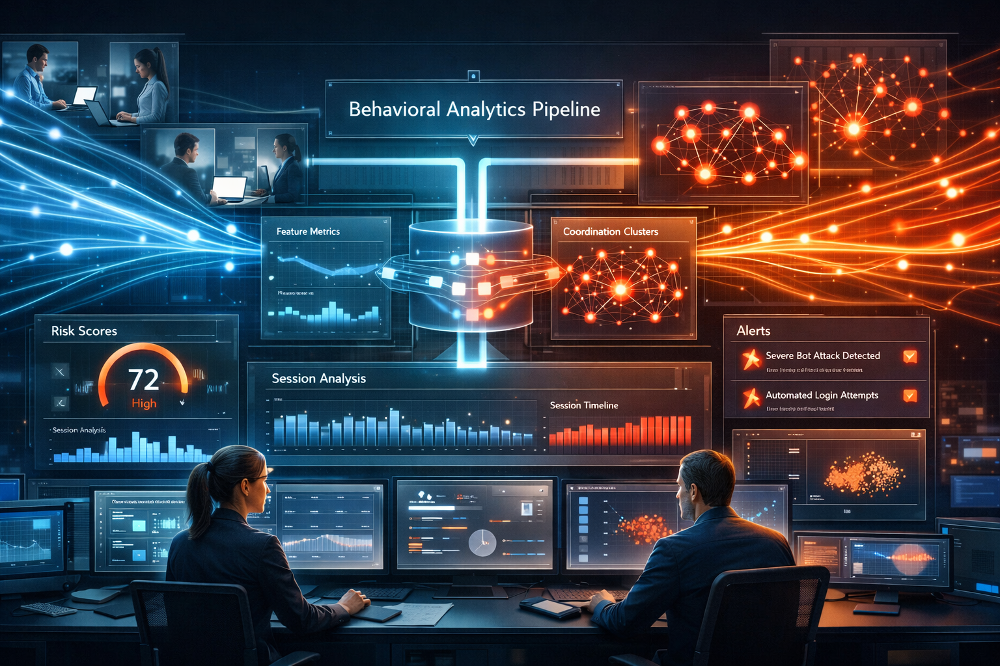
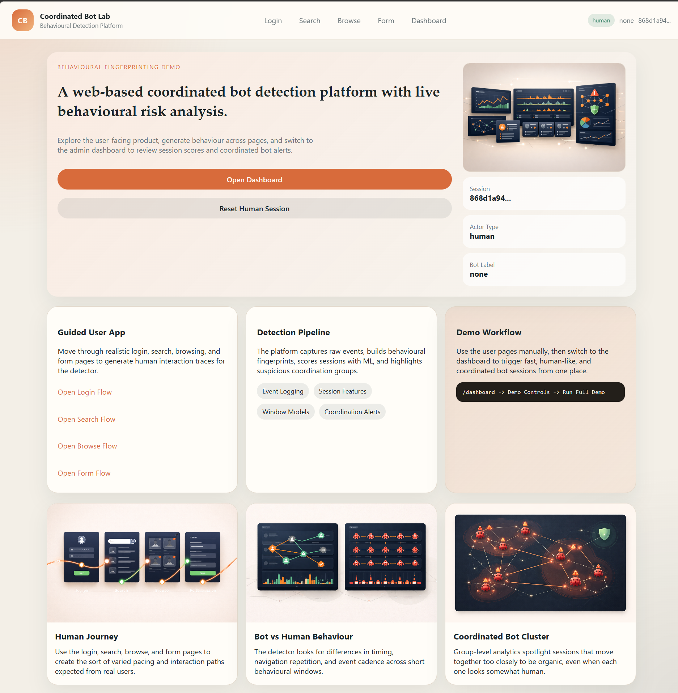
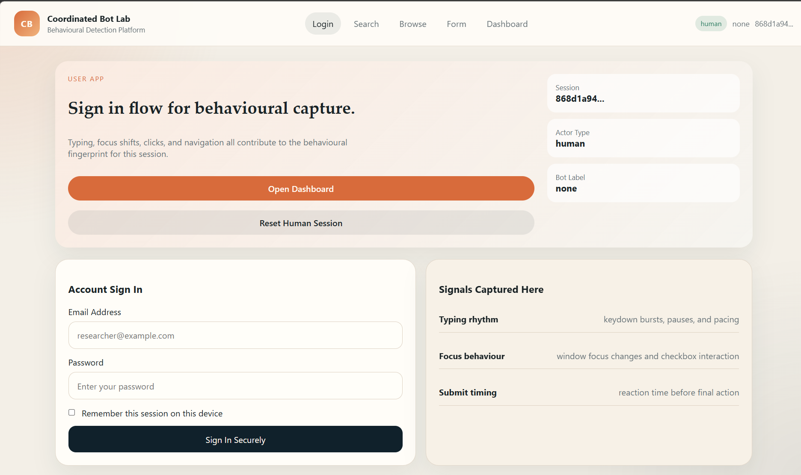
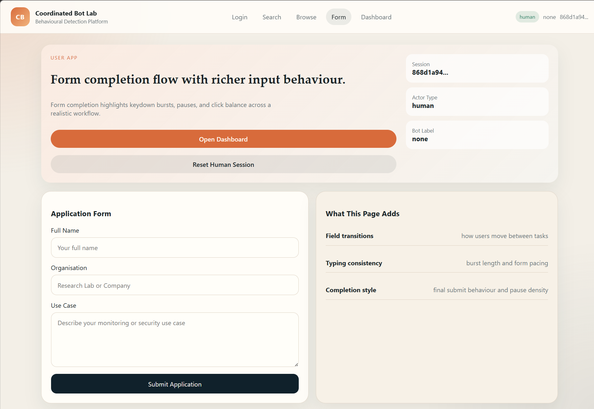
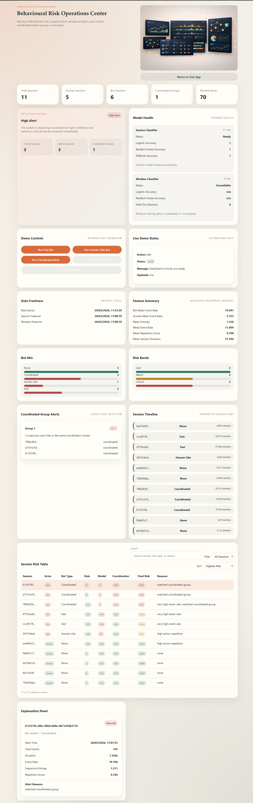
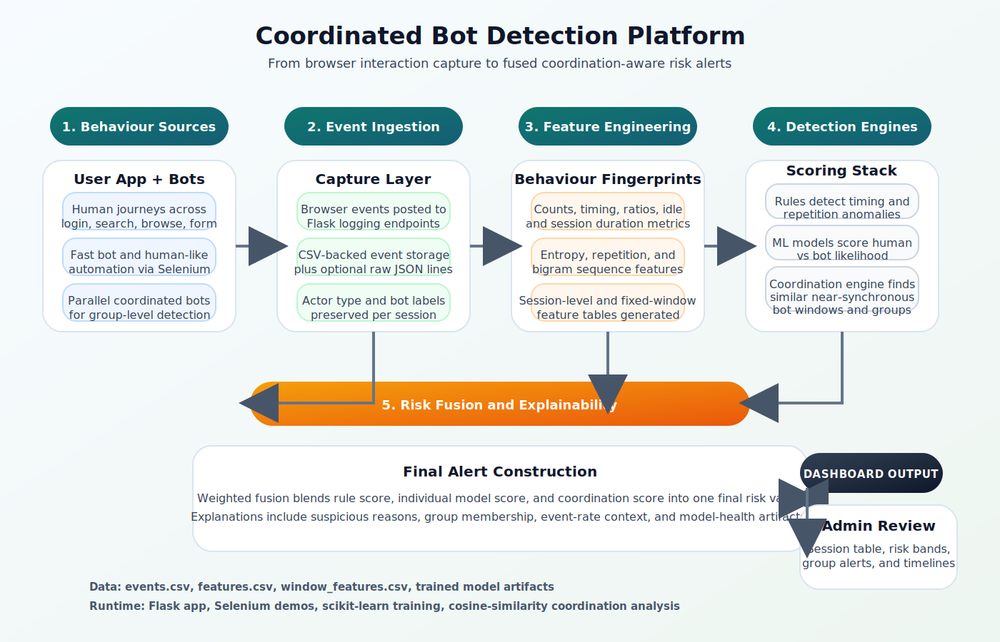
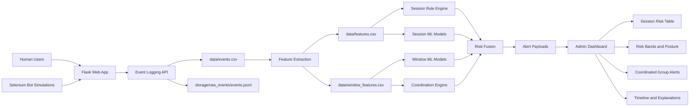

# Coordinated Bot Detection Platform

<p align="center">
  
</p>

<p align="center">
  
  
  
  
  
</p>

<p align="center">
  A web-based behavioural analytics project for detecting <strong>individual bots</strong> and <strong>coordinated bot groups</strong> using event logging, feature engineering, machine learning, and short-window similarity analysis.
</p>

---

## Overview

This project simulates realistic user journeys through a small web application, records browser interaction events, transforms those events into behavioural fingerprints, and scores sessions for bot risk.

It is designed to demonstrate a full detection workflow:

- `Ingestion`: capture click, scroll, keydown, and mousemove events.
- `Session analytics`: build behaviour features for each session.
- `Window analytics`: split sessions into short windows for finer-grained scoring.
- `Rule-based detection`: flag suspicious timing and repetition patterns.
- `ML detection`: classify human vs bot behaviour with trained models.
- `Coordination detection`: find bot sessions that move with unusually high similarity in a narrow time range.
- `Dashboarding`: present risk scores, coordination groups, and supporting evidence in a visual admin UI.

## Why This Project Stands Out

- Attractive end-to-end demo with both a user-facing flow and an admin dashboard.
- Supports multiple bot behaviours: `fast`, `human_like`, and `coordinated`.
- Combines rules, machine learning, and graph-style grouping rather than relying on one signal.
- Uses both full-session and fixed-window features, which makes coordination analysis more reliable.
- Includes visual assets, training scripts, simulation scripts, and dashboard controls in one repo.

## Key Features

| Area | What it does |
| --- | --- |
| `Web UI` | Multi-page Flask app for landing, login, search, browse, form, and dashboard views |
| `Event Logging` | Stores browser activity into `data/events.csv` with actor and bot labels |
| `Feature Extraction` | Creates `features.csv` and `window_features.csv` from raw event streams |
| `Rule Engine` | Flags high event rate, low timing variance, click-without-movement, and repetitive patterns |
| `ML Models` | Trains Logistic Regression and Random Forest classifiers for bot detection |
| `Coordination Engine` | Uses cosine similarity plus time-gap thresholds to identify suspicious bot pairs and groups |
| `Risk Fusion` | Combines rules, ML scores, and coordination evidence into a final risk score |
| `Demo Automation` | Runs Selenium bots directly from the dashboard or via standalone scripts |

## Project Structure

```text
bot-detection_01/
|-- app.py
|-- bot_simulation/
|-- coordination_analysis/
|-- data/
|-- detection/
|-- feature_extraction/
|-- ingestion/
|-- models/
|-- processing/
|-- static/
|-- storage/
`-- templates/
```

## Screenshots

These screenshots highlight the user-facing flow and the detection dashboard experience.

### UI Gallery









## System Architecture

The platform follows a layered pipeline from event capture to fused risk scoring and visual review.



### Mermaid Diagram



### Architecture Flow

1. Browser activity is captured from the user app pages and posted to the logging endpoint.
2. Raw event data is stored in CSV form and optionally normalized through ingestion helpers.
3. Feature engineering builds both session-level and fixed-window behavioural features.
4. Session and window models estimate the probability of bot behaviour.
5. Rule checks add deterministic reasons for suspicious timing or repetition.
6. Coordination analysis compares bot windows and groups highly similar near-synchronous sessions.
7. Risk fusion combines the signals into a final alert shown in the admin dashboard.

## Detection Logic

### 1. Rule-Based Signals

The rule engine highlights sessions with signals such as:

- Very high event rate
- Very low timing variance
- Many clicks without mouse movement
- High interaction repetition

### 2. Individual Session Models

The training pipeline uses engineered features such as:

- Event counts and ratios
- Mean, min, max, and standard deviation of inter-event timing
- Session duration and event rate
- Idle behaviour
- Sequence entropy
- Repetition score
- Behaviour bigram frequencies

### 3. Coordination Analysis

Coordinated bot detection focuses on:

- Selecting bot-labelled windows as candidates
- Building a cosine similarity matrix from behavioural features
- Marking highly similar windows that start within a short time threshold
- Clustering suspicious pairs into larger coordinated groups

### 4. Final Risk Fusion

Final risk is derived from a weighted blend of:

- Rule score
- Individual model score
- Coordination score

This helps the system avoid depending on any single signal source.

## Included Bot Profiles

| Bot Type | Behaviour |
| --- | --- |
| `fast` | Moves quickly through the workflow with low hesitation and compressed timing |
| `human_like` | Uses more variation, slower typing, and less obviously robotic pacing |
| `coordinated` | Launches multiple similar sessions in parallel to simulate grouped automation |

## Data and Artifacts

The repository already includes generated artifacts and samples under:

- [`data/events.csv`](data/events.csv)
- [`data/features.csv`](data/features.csv)
- [`data/window_features.csv`](data/window_features.csv)
- [`models/bot_model.pkl`](models/bot_model.pkl)
- [`models/logistic_model.pkl`](models/logistic_model.pkl)
- [`models/session_metrics.json`](models/session_metrics.json)
- [`models/window_metrics.json`](models/window_metrics.json)
- [`models/feature_importance.png`](models/feature_importance.png)

## Getting Started

### Prerequisites

- Python `3.10+`
- Google Chrome installed
- A Chrome WebDriver compatible with your installed Chrome version

### Install Dependencies

Create a virtual environment and install the libraries used in the codebase:

```bash
pip install flask pandas joblib matplotlib scikit-learn selenium
```

Optional:

```bash
pip install xgboost
```

## Run the Project

### 1. Start the Flask application

```bash
python app.py
```

The app runs locally at:

```text
http://127.0.0.1:5000
```

### 2. Generate behaviour

Use the UI manually:

- Open `/`
- Move through `Login`, `Search`, `Browse`, and `Form`
- Open `/dashboard` to inspect results

Or run the built-in bot simulations:

```bash
python bot_simulation/fast_bot.py
python bot_simulation/human_like_bot.py
python bot_simulation/coordinated_bots.py
```

### 3. Extract features

```bash
python feature_extraction/extract_features.py
```

### 4. Train models

```bash
python models/train_model.py
python models/train_window_model.py
```

### 5. Run coordination analysis

```bash
python coordination_analysis/detect_coordination.py
```

## Dashboard Workflow

The admin dashboard at `/dashboard` is the easiest way to demonstrate the full system.

- Run `Fast Bot`, `Human-Like Bot`, or `Coordinated Bots`
- Refresh analytics from the UI
- Review session rows, risk bands, posture state, and coordinated alert groups
- Use `Run Full Demo` for an end-to-end showcase

## Core Modules

| Module | Responsibility |
| --- | --- |
| [`app.py`](app.py) | Flask app, routes, dashboard payload generation, and demo orchestration |
| [`processing/feature_engine.py`](processing/feature_engine.py) | Session and window feature extraction |
| [`detection/rules.py`](detection/rules.py) | Deterministic suspicious-behaviour rules |
| [`detection/individual_model.py`](detection/individual_model.py) | Dataset validation and training input preparation |
| [`detection/coordination_engine.py`](detection/coordination_engine.py) | Similarity scoring, suspicious pair detection, and clustering |
| [`detection/risk_fusion.py`](detection/risk_fusion.py) | Final fused risk calculation |
| [`models/train_model.py`](models/train_model.py) | Session-level model training and feature importance output |
| [`models/train_window_model.py`](models/train_window_model.py) | Window-level model training |
| [`bot_simulation/`](bot_simulation/) | Selenium-based bot behaviour generators |

## Visual Assets

The repo already includes strong visual support assets for demos and documentation:

- `static/images/landing-hero.png`
- `static/images/human-journey.png`
- `static/images/bot-vs-human-behaviour.png`
- `static/images/coordinated-bot-cluster.png`
- `static/images/security-operations-dashboard.png`

## Reliability Notes

This repository is reliable as a research demo and coursework-style detection platform, with a clear and reproducible flow from simulation to analytics. For production use, you would typically add:

- A pinned `requirements.txt`
- Structured logging and error monitoring
- Persistent database storage instead of CSV-first storage
- Authentication and access controls for dashboard actions
- Model versioning and experiment tracking
- More robust evaluation on larger real-world datasets

## Future Improvements

- Stream events through an API and queue instead of writing directly to CSV
- Add live charts with websocket updates
- Introduce device fingerprint and network-level signals
- Persist alerts and case review notes in a database
- Add unit tests and integration tests for feature extraction and scoring
- Containerize the application for easier deployment

## License

This repository does not currently include a license file. Add one if you plan to share or publish the project externally.
